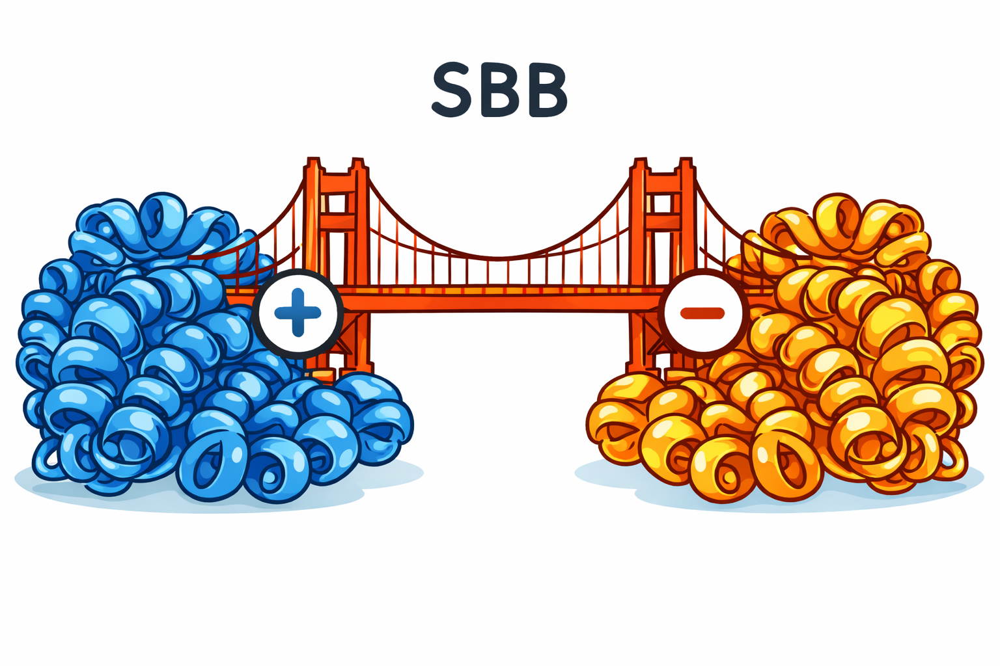

<h1>
<p align="center">
    
</p>
</h1>

[](https://python.org/downloads)

# Salt Bridge Builder
Salt Bridge Builder (SBB) is a python-based tool that identifies uncharged-to-charged mutations that result in interprotein salt bridges.

## Table of Contents
- [Dependencies](#dependencies)
- [Installation](#installation)
- [File Input and Output](#file-input-and-output)
- [Minimal Working Example in Script](#minimal-working-example-in-script)
- [Minimal Working Example in Terminal](#minimal-working-example-in-terminal)

## Dependencies
This project uses the following main dependencies:
*   [NumPy](URL) (Version > 2.4.2)
*   [Pandas](URL) (Version > 3.0.1)
  
## Installation
```bash
conda create -n sbb-env
conda activate sbb-env
pip install sbb
```
## File Input and Output
For an example, run the test.py file
```python
python test.py
```
## Minimal Working Example in Script
For an example, run the test.py file. 
Notice within test.py, the example input is the multi-frame PDB file ().
The results of running the find_putative_sb function are two numpy arrays that contain salt-bridge location information
```bash
python test.py
```

## Minimal Working Example in Terminal
For an example, run the test.py file. 
Notice within test.py, the example input is the multi-frame PDB file ().
The results of running the find_putative_sb function are two numpy arrays that contain salt-bridge location information
```bash
python test.py
```
